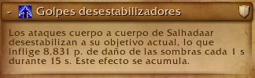
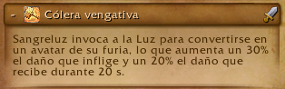

# Aguja del vacio (6 boses)

## Imperator Averzian

### Resumen

Esta pelea es sencilla de entender ya que consta de un tablero de gato (tic tac toe) en el cual hay que jugar gato contra el boss, o mas bien evitar que el boss consiga 3 en linea, estos 3 en linea son puestos por el boss invocando un portal y dejando un add donde mediante una mecanica de tanke podemos eliminar 2 de los 3 adds que invoca el boss, hay que evitar que el add que queda forme el 3 en linea con los demas que estan quedando en cada ciclo del boss, nunca se debe dejar el cuadro 5 ya que el boss va ahi a castear ciertas mecanicas.

#### Mecanica principal (GATO o 3 en linea)

Se debe eliminar 2 de los 3 adds que se invocan, esto mediante un soak de raid:

Aca los **Tanks** son marcados, cada uno con un soak, asi que deben colocarse en su respectivo add y ver que no se forme el 3 en linea.

Los demas **Raiders** deben entrar al soak y ayudar al tank a soportar el daño, esta mecanica debe ser curado por los **Healers**.

#### Hero 

En hero esta mecanica aplica un debuff por lo que debe hacerse en grupos 2 grupos de raid.

al eliminar 2 adds el tercero seguira casteando y al terminar comienza otra cast que hay que interrumpir 

todos se deben mover de esta mecanica ya que hace daño por segundo los rayos que salen.

### Mecanicas Secundarias

#### Colera del olvido

el boss coloca circulos de los cuales vana salir lanzar que se alejan del boss en linea recta se debe esquivar tanto el circulo como la lanza.

#### Avance de las sombras

El boss va a invocar adds que se deben matar cada ciclo de la pelea.
##### Importante

En esta fase hay 2 adds que son de gran importancia y se deben cumplir su mecanica

- Este add se debe interrumpir siempre ya que su cast coloca un escudo a los demas adds

- Este add se debe poner atencion ya que al llegar al 30 % de vida se va hacia el portal mas cercano y se cura la vida.

### Healers

Los heals deben tener cuidado con 2 mecanicas que causan mucho daño a la raid.

Primera soak de tanke:

segunda daño constante a la raid con picos esporadicos en cada ciclo de la pelea:

ocurre 2 veces cada ciclo.

### Tankes

Los tankes se dividen en 2 tareas tankear al boss y tankear los adds y deben tener cuidado con 3 mecanicas:

Primera soak:

Segunda Mecanica de tanke:

Esta mecanica es peligrosa porque reduce la vida maxima asi que debe calcularse bien el cambio de tank maximo 8 acumulaciones inclusive antes.

tercera mecanica de heroico:

Esta emcanica obliga a no tener nunca al boss cerca de ningun piso reclamado por el boss.

#### Extra:
Los adds nunca deben estar cerca del boss ya que estos se buffan e incrementan el daño y reducen el daño que reciben.

## Vorasius

### Resumen

Esta pelea es un dps check y es la mas sencilla de toda la raid cuenta con 4 pasos principales los acuales son: estar dentro de los muros, esquivar suelos, matar adds para romper los muros y esquivar la mecanica principal del boss.

#### Mecanica principal

La mecanica principal de este boss es gestionar muros para esquivar un rayo frontal los muros son invocados mediante una mecanica de soak de tankes la cual deben turnarse 2 cada tanke:

esta mecanica invocara un muro a su lado al golpear la primera vez por lo que todos los jugadores debe esta en el centro de la arena y no quedar fuera de los muros.

Seguido de esto al golpear al tanke inicia una mecanica de esquivar circulos donde todos deben moverse y esquivarlos:

cada tanke debe comerse 2 soaks con defensivo y cambiar de tanke.

Seguido de esto el boss va a castear Expulsion de parasitos:

Donde saldran charcos que hay que esquivar y dejara 4 adds con agro fixeado.

Estos adds son importantes ya que son los que al morir van a explotar y hacer un aoe que permitira romper los muros.

Luego de esto el boss comenzara a preparar un rayo donde se le iluminara una de sus manos y lanzara un rayo barriendo la sala desde el aldo que se ilumina hasta un poco mas del centro por lo que la raid debe moverse al lado contrario y volver al centro luego de la mecanica.

este es el ciclo principal de la pelea y se repite continuamente hasta el enrage donde l boss lanzara el rayo a un objetivo aleatorio lo mata y cambia de objetivo instantaneamente.

### Healers

los healers deben tener en cuenta 2 habilidades:

la primera:

la cual el boss va a estar casteando repetidamente durante toda la pelea.

la segunda:

el cual es la mecanica de soak del tanke y que puede provocar mucho daño en la raid si no se tienen una reaccion rapida.

### Tankes

Los tankes deben tener cuidado con los soaks y intercambiarse cada 2 golpes usando siempre un defensivo fuerte en el segundo impacto.

### DPS

los dps deben encargarse de mover correctamente los adds que los seleccionen como objetivo y matarlos unicamente cerca de un muro, no antes.

Estos adds no hacen mucho daño.

## Salhadaar fallen king (otra vez)

### Resumen

Esta pelea consta de 2 partes durante el ciclo de pelea, y es una pelea de prioridad de targets por lo que es single target.

la primera parte de la pelea consta de un ciclo de combate sencillo, donde 

- El boss va a invocar orbes

 desde 2 portales (los mas cercanos) de los 3 presentes en la sala, estos orbes deben ser destruidos rapidamente antes de que estos alcancen al boss, se pueden relentizar mas no mover y no deben ser tocados por ningun jugador.

#### Hero
 en dificultad heroica estos orbes aplican un debuff a toda la raid que hace mucho daño por lo que no deben matar a la vez.

- El boss va a hacer daño a toda la raid y a aplicar un debuff que hace daño en el tiempo.

- El boss va a lanzar copias de si mismo

las cuales deben ser interrumpidas o stuneadas por los jugadores ya que si terminan su casteo haran daño a los jugadores y dejaran manchas en el suelo.

 - El boss va a marcar a 3 jugadores con un debuff el cual es un healing absorb que debe ser curado.
 
 
 
  Al caducar o curarse por completo se genera un charco bajo el jugador que va consumiendo la sala.

 

- adicionalmente el boss marcara al tanke actual y le lanzara una bomba

La cual tirara espinas en 5 direcciones visibles antes del impacto, por lo que este debe alejarse y los jugadores esquivar esto.

#### Hero
En dificultad heroica ademas se marcara a jugadores aleatorios con esta misma mecanica.

Este es el ciclo principal de la pelea al cumplir 2 de estos ciclos el boss alcanza 100p de energia y entra en una interfase 

donde recibira daño aumentado y hara una habilidad donde lanzara 5 rayos que rotaran en una direccion haciendo mucho daño y ademas irradiando daño constante.

al terminar esta habilidad el boss dejara un charco debajo suyo por lo que este debe ser movido a un lugar donde no estorbe el charco que dejara.

### Tankes

Los tankes deben tener cuidado a 2 habilidades y al posicionamiento del boss

la primera es:

la cual es la mecanica de tank y deben cambiarse cada 8 cargas aproximadamente.

la segunda e:

la cual sera un daño grande y debe ser mitigado con algun defensivo fuerte.

### Healers

los healers deben tener cuidado con 3 habilidades.

la primera es:

la cual hara daño constante a los jugadores y debe ser gestionado con sanaciones en el tiempo o ciclicas.

la segunda es:

donde el boss va a aplicar un healing absorb al jugador y este debe ser curado para cancelar ese efecto el el jugador, hay que tener cuidado con no curarlos rapidamente y dejar los charcos en media sala.

la tercera es:

donde los jugadores de la banda recibiran mucho daño constante y debe ser gestionado con cds de curacion fuertes.

### DPS

Los jugadores dps solo deben tener atencion a matar a los orbes lo mas rapido posible e interrumpir a todas las copias que salgan, ademas de posicionarse correctamente para no manchar la sala en exceso con las marcas de:

.

## Vaelgor y Ezzorak

### Resumen

Esta pelea consta de 2 fases

#### Fase 1

Durante esta fase los boses van a estar uno en el aire y otro en el suelo, la raid debe ser dividida con un daño similar, el boss que esta en el aire no puede ser movido y estara volando en un lugar todo el tiempo, el boss del suelo si podra ser movido y debe ser alejado del boss volador o estos se pontenciaran, ademas, deberan tener no mas de 10% de diferencia en sus vidas y estos deberan morir lo mas cercano posible ya que al morir el dragon restante incrementa mucho su daño.

al iniciar el boss que esta volando sera Ezzorak el que no sera Vaelgor (el boss mas oscuro) por lo que iniciamos explicando a Vaelgor, el ciclo de habilidades de este boss sera el siguiente:

- Al comienzo de la pelea el boss seleccionara a un jugador con un cono frontal

 sera identificable por la flecha morada en su cabeza

este cono mete fear y daño a todos los jugadores que alcance por lo que el jugador que lo reciba debera ser dispeleado y curado por los healers (es posible utilizar inmunidades para evitar todo el daño y mecanicas).

- la siguiente habilidad que hara el boss sera un aliento frontal
  

esta habilidad sera dirigida al tanke que tenga al boss y lo empujara hacia atras constantemente

Al terminar de canalizar esta habilidad quedara un orbe el cual amarrara a todos los jugadores al centro de este mismo y los jugadores deberan alejarse y romper su cuerda saliendo de la zona marcada del orbe,

En esta habilidad el tanke principal debera dejarse su amarre para dar tiempo a los healers de levantar la raid y asi poder romper su amare y causar daño a la raid controladamente.

con esto terminamos con las habilidades principales de este boss, ahora seguiremos con Ezzorak y sus habilidades.

- La primer habilidad es 

la cual funciona de manera llamativa ya que lanzara un rayo largo que marcara la direccion de la habilidad, la cual consistira en lanzar un agujero negro grande que se movera lentamente hacia la direccion que se pudo observar y chocara contra el limite del area y hara un gran ciculo de daño el cual tiene una mecanica y es que si el agujero negro atravieza a 5 jugadores el area reducira su tamaño significativamente.

##### Hero
En heroico esta habilidad marca a los jugadores haciendo imposible que puedan activar los mismos 5 la mecanica de reduccion de area por lo que deberan rotar los jugadores.

como se puede observar el agujero negro spawnea con un aura morada y al pasar por 5 jugadores se hace blanca indicando que alcanzo la reduccion maxima de area.

- la segunda habilidad consta de la invicacion de adds y es la mecanica principal del boss y que va a marcar los wipes principalmente la habilidad es la siguiente:

ene sta habilidad el boss marcara a todos los jugadores con un area morado, y despues de unos segundos invocara un orbe debajo de cada jugador incluidos tankes y healers, estos orbes deben ser destruidos lo mas rapido posible ya que castearan daño a toda la raid, por lo que deben solocarse cerca unos de otros, pero no stackeados.

estos adds pueden ser interrumpidos con cualquier cc.

Muy bien con estos cubrimos las habilidades principales de ambos bosses ahora el tema complejo de esta pelea es que todas estas habilidades suceden simultaneamente durante toda esta fase intercalandose con el siguiente orden
1. Aliento pavoroso 
   
2. Penumbra 
   
3. Nulirayo 
   
4. Aullido del vacio 

las ultimas dos habilidades suelen suceder a la vez por lo que es importante retener el orbe generado por nulirayo para no hacer daño excesivo a la raid.

- Ademas durante toda la pelea Xalathat estara casteando la siguiente habilidad:

en la cual los healers deben poner atencion a los jugadores marcados con esta habilidad ya que puede caer multiples veces en el mismo objetivo y recibir mucho daño, los jugadores marcados deberan tambien gestionar sus vidas mediante pociones o piedras de salud y defensivos personales.

Este patron se repetira hasta alcanzar 100p de energia en los dragones, una vez que estos alcanzan la energia necesario entraremos en la siguiente fase casteando la siguiente habilidad:

causando una gran cantidad de daño y entrando asi en la nueva fase.

#### Fase 2

Durante esta fase ambos dragones estaran causando daño constante a la raid y los jugadores marcados por Xalathat veran todas sus marcas discipadas

- Uno de los paladines empezara a castear una habilidad que nos reducira el daño recibido por los dragones 

y aparecera un add el cual va a causar daño constante a la raid y debera ser eliminado lo antes posible.

durante esta fase el daño de la raid sera elevado por lo que se requeriran cds de healing.

una vez finalizada esta fase los dragones intercambiaran posiciones (suelo y aire) y se repetira el ciclo de la primer fase hasta morir.

### Tankes

durante toda esta pelea los tankes deben esta atentos a 2 habilidades y el alejamiento de los boses ademas de que deberan cambiar constantemente al dragon que se encuentra en el suelo ya que el aereo no cuenta con agro.
 las habilidades a tener en cuenta para Vaelgor seran

 la primera:

Esta habilidad colocara un debuff en el tanke y debera ser cambiado cada maximo 1 carga ademas tambien golpeara a todos los jugadores que se encuentran en su cola por lo que deberan colocar al boss de manera tal que no golpee a la raid.

la segunda habilidad sera:

donde el tanke actual al momento de lanzarce la habilidad debera mantener el orbe con vida evitando caer al centro de este mientra se estabilizan las vidas de la raid y seguido estallara el orbe una vez que el orbe es invocado el tank secundario debera romper su amarre y tomar el agro del boss siendo este el ciclo para Vaelgor.

en el caso de Ezzorak es la misma situacion solamente que las habilidades a tener en cuenta son:

la primera:

la cual hace el mismo efecto que la de Vaelgor

la segunda habilidad sera:

donde deberan cambiar el agro aproximadamente cuando esta suceda.

### Healers

Los healers en esta pelea tiene un trabajo dificil ya que hay mucho daño en el tiempo con picos de daño constantes y una fase de mucho daño sostenido asi que estos deberan gestionar los cds en dos principales habilidades y mantener la vida de los jugadores marcados por Xalathat ademas de dispelear el posible fear que pueda tener un jugador o varios, las habilidades donde se deberan gestionar los cds son las siguientes:

la primera:

durante esta habilidad los jugadores recibiran mucho daño cada vez que los adds casteen por lo que deberan estar atentos y utilizar cds de healing en area.

la segunda:

al ocurrir esta habilidad entraremos en unos segundos de mucho daño constante a toda la raid por lo que debera ser gestionado con cds de healing para mantener la vida de los jugadores arriba.

### DPS

los dps en esta pelea tiene una tarea especifica y es matar los diferentes adds que van saliendo en la pelea y dejar los adds cerca unos de otros para facilitar esta tarea ademas de interrumpirlos cada que sea posible, tambien deberan estar atentos a romper sus amarres lo mas pronto posible y activar el agujero negro a su maxima reduccion de area.

## Lightblinded Vanguard

### Resumen

Esta pelea cosnta de 3 boses con vidas separadas los cuales deberan morir al mismo tiempo o cercano donde cada uno de estos va aejecutar diferentes mecanicas que debemos solventar como jugadores, ocurriendo estas simultaneamente durante toda la pelea.

al inicio de esta pelea vamos a tener un momento en el que 2 de los 3 bosses se tirar imunidad con lo que debemos todos hacer focus al unico de los 3 que no tenga inmunidad y hacer el maximo daño posible, esta es una pelea de prioridad de target por lo que es single target con cleave.

el ciclo de combate de esta pelea consta de cumplir mecanicas hasta que un boss consiga el total de su recurso y ejecute una habilidad definitiva llamada Aura, por lo que todas las habilidades pasaran simultaneamente menos la definitiva, teniendo esto en cuenta voy a explicar cada una de las habilidades de cada boss en orden del primero al ultimo que utilizara su Aura.

####  General Amias Bellamy

Este sera el primer boss en castear su Aura dado que incia la pelea con su barra de recurso casi llena por lo que rapidamente lanzara su Aura la cual es:

una vez que este boss empiece a castear este aura los tankes y jugadores deberan salir rapidamente del area,

Los jugadores deberan esquivar los escudos que van saliendo constantemente desde el centro del Area, al finalizar esta habilidad en esa area quedara una consagracion la cual hara mucho daño a la raid.

- la siguiente habilidad de este boss sera la siguiente:

esta habilidad marcara a varios jugadores y les lanzara un escudo que causa daño a todos los jugadores que esten dentro del circulo y aplica un debuf de absorcion de healing que debera ser curado.

- la siguiente habilidad que tiene este boss es un daño constante a toda la raid el cual se incrementa cada vez que otro de los bosses lanza su aura:
  

con esto terminamos con Bellamy.

####  Comandante Venel Sangreluz

Este sera el siguiente boss en castear su aura y ademas sera el primer boss el cual al principio de la pelea no tendra la inmunidad  recobora daño aumentado al tere colera vengativa lanzado:

por lo que se debe hacer mucho daño a este.

el aura que lanzara este boss es la siguiente:

aura la cual potencia el daño que inflinjen los demas boses y de igual manera deberan ser movidos fuera del area, dejando al final de su casteo una consagracion.

La siguiente habilidad que utilizara este boss es:

En la cual marca a varios jugadores con un area que se debe sockear equitativamente para evitar daño letal en un solo jugador (puede ser evitado con inmunidades).

al finalizar este sockeo la habilidad dejara martillos en el area.

los caules giraran y se alejaran lentamente del punto central causando mucho daño

con esto terminamos con las habilidades del boss 2.

####  Capellana de guerra Senn

Este sera el ultimo boss que usara su habilidad de Aura la cual es:

la cual causa que cualquier jugador que ataque a los demas boses sufra de silencio o desarme, por lo que hay que salir rapidamente dle area.

dejando al final de su casteo una consagracion.

la siguiente habilidad de este boss es:

esta habilidad causa que los jugadores mas cercanos sufran de una absorbcion de healing grande al cual deberan curar los healers lo mas rapido posible

la siguiente habilidad que usa este boss es:

la cual este boss lanzara cada vez que sus compañeros lancen su aura esta habilidad causa mucho daño por lo que debe ser superada con cds de healing.

la ultima habilidad que lanzara este boss es :

la cual consta de 2 partes la primera es la carga donde el boss saldra cargando hacia un jugador causandole daño y se quedara quita en el lugar casteando luz cegadora habilidad que debera ser interrumpida una vez que se elimine por completo el escudo del boss.

esta habilidad si se termina de castear stuneara a toda la raid y cargara mas energia para su aura.

y con esto terminamos la explicacion dle ultimo de los 3 bosses, comomencione la incio estos boses vana estar tirando todas las habilidades simultaneamente a excepcion de las auras las cuales seran casteadas en orden.

### Tankes

los tankes deben tener en cuanta 2 habilidades y mover a los boses segun corresponda y esquivar mecanicas segun corresponda, las habilidades que deben tener en cuenta los tankes son:

la primera:

Esta habilidad sera casteada por Bellamy y marcara al tanke para recibir mas daño de escudo del honrado, por lo que debera haber un intercambio de tanke al momento de lanzar esta habilidad.

la segunda es:

Esta habilidad funciona igual a la anterior y los tankes deberan estar atentos a que se lance la sentencia correspondioente para hacer un intercambio rapidamente y asi evitar el daño.

En esta pelea unicamente se tankean 2 de los 3 boses siendo Senn el unico boss que no tiene agro y se movera cerca de los jugadores toda la pelea.

### Healers

los healers en esta pelea tiene una tarea dificil ya que deberan tener en cuenta todas las absorciones de healing que hay presentes en la pelea y lidiar con estas, como habilidades principales existen 3 las cuales seran de suma imporantcia y donde deberan ser utilizados los cds de healing que son las siguientes:

la primera:

esta habilidad causara una gran cantidad de daño a toda la raid que debera ser curada.

la segunda:

Esta habilidad causara una gran cantidad de daño a toda la raid por lo que tambien debera ser lidiada con cds de healing.

la tercera:

Esta habilidad al principio de la pelea no sera un daño considerable pero cada vez que avance el tiempo sera mas problematica y requerira al final de la pelea utilizar cds de healing para sostener las vidas.

sumado a todo esto existen habilidades que requieren ser dispeleadas al momento por lo que tambien deberan estar atentos a ese tipo de habilidades.

### DPS

Los dps en esta pelea tienen la tarea secilla y es cumplir con cada mecanica de soak y cambiar oportunamente de target teniendo en cuenta que se debe reducir el escudo de Senn e interrumpirla y ademas mantener las vidas de los boses cerca en porcentaje para evitar su mecanica de enrage al final de la pelea.

## Alleria Brisaveloz

de este boss no se sabe nada hasta que salga la raid.

# Marcha sobre Quel Danas (2 boses)

## Belo ren

Este boss cambio mucho de la beta al retail entocnes mejor lo vemos en su momento con los cambios.

## Cae la medianoche 

Nose sabe nada de este boss.

# La Onirifalla

## Chimaerus

### Resumen

Esta pelea es una pelea de gestions de adds con dos planos existenciales donde una parte de la raid va a estar fuera y otra parte dentro ambos tiene  tareas que cumplir y deben ayudar a los jugadores del otro plano a cumplir su objetivo , es una pelea con muchos adds por lo que se considera una pelea AOE.

Esta pelea va a estar dividida en 2 fases siendo estas de la siguiente manera.

#### Fase 1

Durante esta fase el boss inciara marcando al tanke actual con un soak:

habilidad que pondra un debuff al tanke que debera ser cambiado en este momento ya que el tank que recibio la habilidad junto a todos los miembros de la raid que sockearon la habilidad al plano onirico.

##### Plano onirico

los jugadores que entren a este plano deberan lidiar con una serie de adds 

todos estos adds tiene dos vidas por asi decirlo un escudo y su vida normal, el escudo solo puede ser reducido por los jugadores del plano onirico y la vida normal por los jugadores en el plano normal, por lo que el objetivo de los jugadores del plano onirico es reducir ese escudo lo mas pronto posible, estos adds utilizan diferentes facultado entre las que algunas deben ser inmterrumpidas y otras esquivadas y provocaran cada vez mas daño.

El tanke debera hacerse cargo de movere y controlar los adds que al perder el esqudo dejaran un area en el suelo.

y al derrotar todos los adds o que se acabe el tiempo seran sacados al plano normal donde podran hacer daño a los adds que lograron sacar del plano onirico.

##### Plano normal

Los jugadores que se queden en el plano normal deberan ayudar a los jugadores del plano onirico limpiando los suelos que van quedando con la siguiente habilidad:

este debuff debera ser dispeleado por los healers una vez que el jugador se posiciono cerca de uno o varios suelos para su limpieza.

al limpiar este debuff causa daño a los jugadores dentro y los eleva por el aire asi que hay que tener cuidado.

Ademas el boss marcara a un jugador cercano con un cono frontal:

causando mucho daño y dejando un sangrado, asi que todos los jugadores deberan salir de este cono rapidamente.

Durante esta fase los adds que van saliendo del plano onirico iran caminando directo al boss pudiendos er relentizados y stuneados, estos deben ser eliminados antes de llegar al boss o le causaran un incremento de daño y daño en area considerable sanandolo tambien.

estos add son prioridad durante esta fase.

Al llegar al maximo de recurso el boss lanzara la habilidad:

en la cual atraera a todos los jugadores y consumira todos los adds restante en cualquiera de los dos planos aplicando el daño en area y todas las mecanicas de la habilidad Esencia Canibalizada, y esto marcara el inicio de la segunda Fase

#### Fase 2

durante esta fase el boss lanzara:

donde volara por una region dle mapa en linea recta provocando daño a su paso e invocando adds y dejando suelos a su paso.

a diferencia de la fase 1 los adds tiene su vida completa y deben ser eliminados rapidamente o se acumularan muchos.

ademas los jugadores seran marcados con el circulo azul que debe ser dispeelado para limpiar los suelos y abrir paso para esquivar.

Luego de algunas devastaciones el boss volvera a caer al suelo con al siguiente habilidad:

la cual hara daño al caer y hara volar a los jugadores y tambien consumira los adds restantes provocando daño, buffando su daño y sanandose.

con esto se da por terminada la pelea del boss repitiendo estos ciclos hasta morir o entrar en enrage,

durante toda la pelea el boss esta casteando un dots a todos los jugadores llamado:

el cual debera ser curado por los healers durante la mayor parte de la pelea.

### Tankes

los tankes en esta pelea deberan solamente turnarse los soaks cambiando de tanke cada uno y mover los adds en el plano onirico de manera que queden lejos del boss.

no tiene mayor complejidad ya que cada fase esta muy marcada por mecanicas donde los tankes no comparten plano.

### Healers

los healers tiene 2 tareas importantes curar los dots que van a estar constantemente durante toda la pelea y dispelear a los jugadores que limpian los suelos, ademas que las fases tambien tiene muy marcado donde se deben usar los cds de healing siendo estos utiles en el plano onirico debido al gran daño que hay dentro y en el plano normal al fallar eliminando adds y que en boss los consuma, mientras que en la fase dos debe usarse los cds al finalizar la fase y que el boss caiga del cielo.

### DPS

Los dps deberan cumplir un papel muy importante y es el de eliminar los adds en ambos planos y procurar que estos nunca lleguen al boss y no queden vivos en cada cambio de fase, ademas de interrumpir a los adds que provocan fear en los jugadores.

y con esto termina esta guia de las raids.

