

# Aguja del vacío (6 bosses)

## Imperator Averzian

### Resumen

Esta pelea es sencilla de entender, ya que consta de un tablero de gato (tic tac toe) en el cual hay que jugar contra el boss, o más bien evitar que el boss consiga 3 en línea.  
Estos 3 en línea son puestos por el boss invocando un portal y dejando un add donde, utilizando una mecánica de tanque, podemos eliminar 2 de los 3 adds que invoca el boss.  

Hay que evitar que el add que queda forme el 3 en línea con los demás que van quedando en cada ciclo del boss.  
Nunca se debe dejar el add del cuadro 5, ya que el boss va ahí a castear ciertas mecánicas y se potencia.

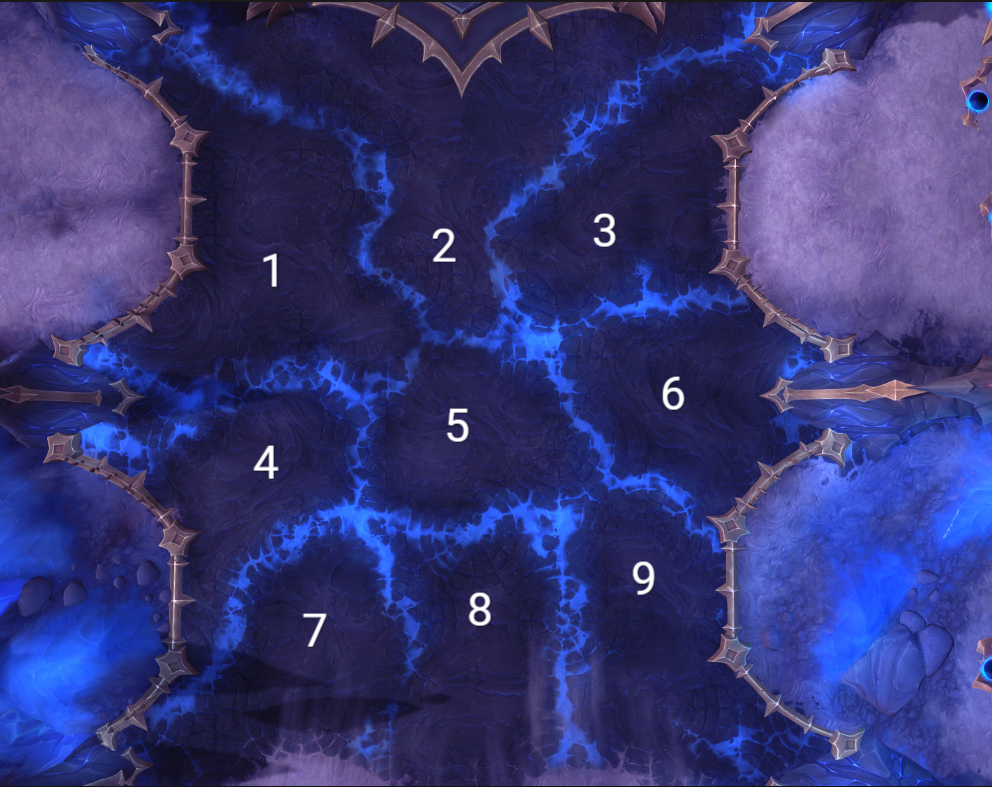

#### Mecánica principal (GATO o 3 en línea)

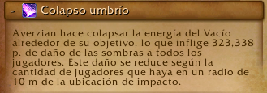

Se deben eliminar 2 de los 3 adds que se invocan, esto mediante un soak de raid:

Acá los **Tanks** son marcados, cada uno con un soak, así que deben colocarse en su respectivo add y evitar que se forme el 3 en línea.

Los demás **Raiders** deben entrar al soak y ayudar al tank a soportar el daño.  
Esta mecánica debe ser curada por los **Healers**.

#### Hero

En hero esta mecánica aplica un debuff, por lo que debe hacerse en 2 grupos de raid.

Al eliminar 2 adds, el tercero seguirá casteando y al terminar comienza otro cast que hay que interrumpir.

Todos se deben mover de esta mecánica, ya que hace daño por segundo a través de los rayos que salen.

---

### Mecánicas Secundarias

#### Cólera del olvido

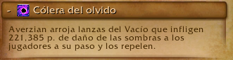

El boss coloca círculos de los cuales van a salir lanzas que se alejan del boss en línea recta.  
Se debe esquivar tanto el círculo como la lanza.

#### Avance de las sombras

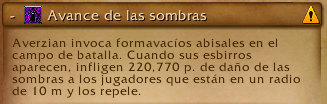

El boss va a invocar adds que se deben matar en cada ciclo de la pelea.

##### Importante

En esta fase hay 2 adds que son de gran importancia y se debe cumplir su mecánica.

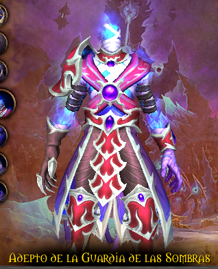

- Este add se debe interrumpir siempre, ya que su cast coloca un escudo a los demás adds.

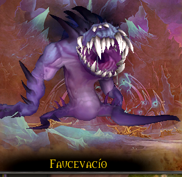

- Este add se debe poner especial atención, ya que al llegar al 30% de vida se va hacia el portal más cercano y se cura la vida.

---

### Healers

Los heals deben tener cuidado con 2 mecánicas que causan mucho daño a la raid.

Primera: el soak de tanque:

Segunda: el daño constante a la raid con picos esporádicos en cada ciclo de la pelea:

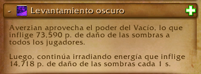

Ocurre 2 veces cada ciclo.

---

### Tanks

Los tanks se dividen en 2 tareas: tankear al boss y tankear los adds.  
También deben tener cuidado con 3 mecánicas:

Primera mecánica: el soak.

Segunda mecánica de tank:

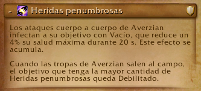

Esta mecánica es peligrosa porque reduce la vida máxima, así que debe calcularse bien el cambio de tank.  
Máximo 8 acumulaciones, inclusive antes.

Tercera mecánica de heroico:

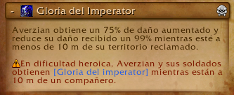

Esta mecánica obliga a no tener nunca al boss cerca de ningún piso reclamado.

#### Extra:

Los adds nunca deben estar cerca del boss, ya que estos se buffan e incrementan su daño y reducen el daño que reciben.

## Vorasius

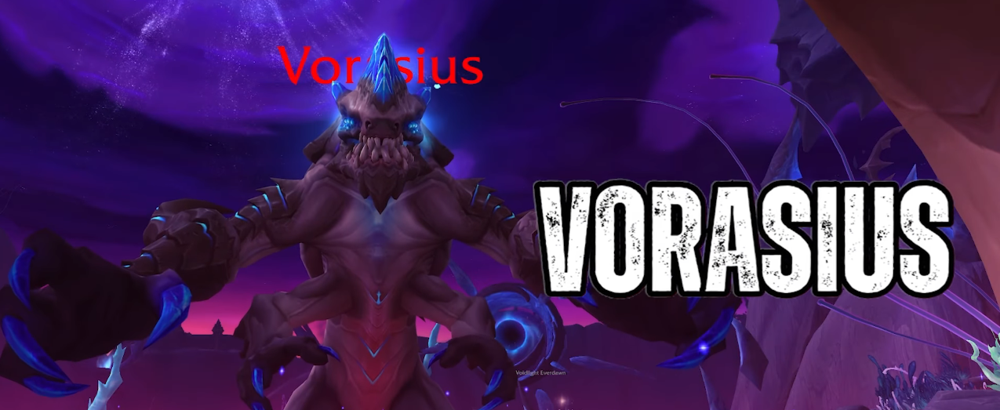

### Resumen

Esta pelea es un DPS check y es la más sencilla de toda la raid.  
Cuenta con 4 pasos principales, los cuales son: estar dentro de los muros, esquivar suelos, matar adds para romper los muros y esquivar la mecánica principal del boss.

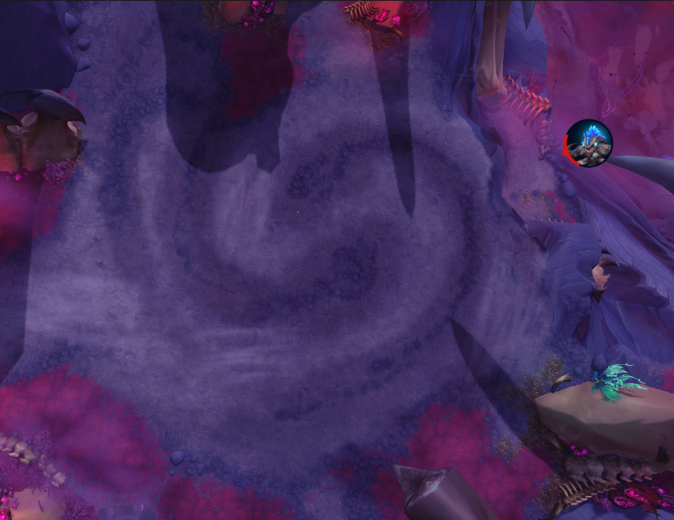

#### Mecánica principal

La mecánica principal de este boss es gestionar muros para esquivar un rayo frontal.  
Los muros son invocados mediante una mecánica de soak de tanks, la cual deben turnarse 2 golpes cada tank:

Esta mecánica invocará un muro a su lado al golpear la primera vez, por lo que todos los jugadores deben estar en el centro de la arena y no quedar fuera de los muros.

Seguido de esto, al golpear al tank, inicia una mecánica de esquivar círculos donde todos deben moverse y esquivarlos:

Cada tank debe comerse 2 soaks con defensivo y cambiar de tank.

Seguido de esto, el boss va a castear Expulsión de parásitos:

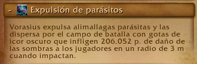

Donde saldrán charcos que hay que esquivar y dejará 4 adds con agro fijado.

Estos adds son importantes, ya que son los que al morir van a explotar y hacer un AoE que permitirá romper los muros.

Luego de esto, el boss comenzará a preparar un rayo donde se le iluminará una de sus manos y lanzará un rayo, barriendo la sala desde el lado que se ilumina hasta un poco más del centro.  
Por lo que la raid debe moverse al lado contrario y volver al centro luego de la mecánica.

Este es el ciclo principal de la pelea y se repite continuamente hasta el enrage, donde el boss lanzará el rayo a un objetivo aleatorio, lo mata y cambia de objetivo instantáneamente.

---

### Healers

Los healers deben tener en cuenta 2 habilidades:

La primera:

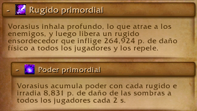

En la cual el boss va a estar casteando repetidamente durante toda la pelea.

La segunda:

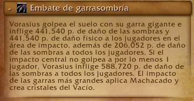

La cual es la mecánica de soak del tank y puede provocar mucho daño en la raid si no se tiene una reacción rápida.

---

### Tanks

Los tanks deben tener cuidado con los soaks e intercambiarse cada 2 golpes, usando siempre un defensivo fuerte en el segundo impacto.

---

### DPS

Los DPS deben encargarse de mover correctamente los adds que los seleccionen como objetivo y matarlos únicamente cerca de un muro, no antes.

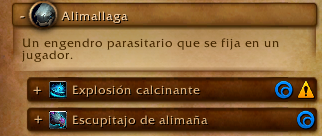

Estos adds no hacen mucho daño.

## Salhadaar Fallen King (otra vez)

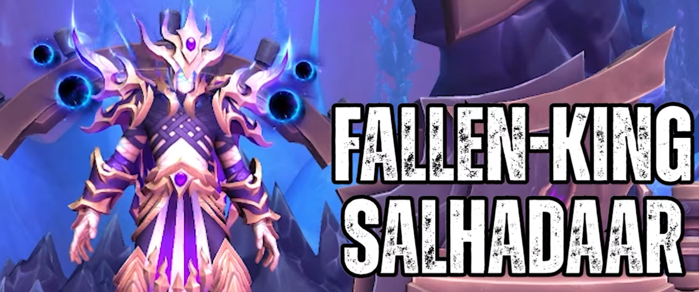

### Resumen

Esta pelea consta de 2 partes durante el ciclo de la pelea y es una pelea de prioridad de targets, por lo que es single target.

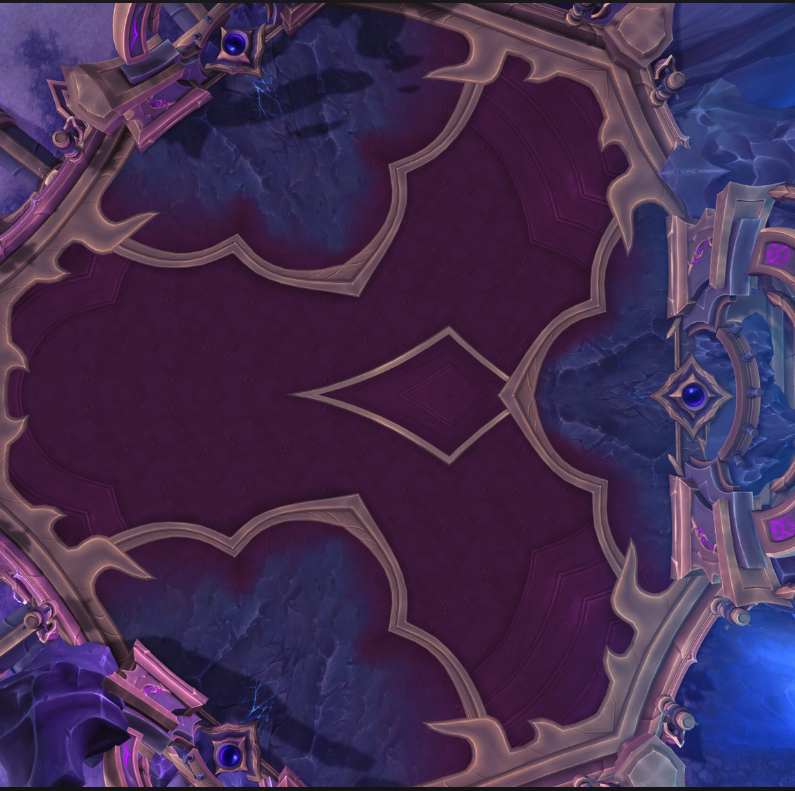

La primera parte de la pelea consta de un ciclo de combate sencillo donde:

- El boss va a invocar orbes:

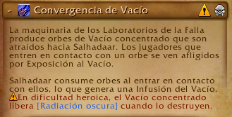

Desde 2 portales (los más cercanos) de los 3 presentes en la sala.  
Estos orbes deben ser destruidos rápidamente antes de que alcancen al boss.  
Se pueden ralentizar, pero no mover, y no deben ser tocados por ningún jugador.

#### Hero

En dificultad heroica estos orbes aplican un debuff a toda la raid que hace mucho daño, por lo que no se deben matar al mismo tiempo.

- El boss va a hacer daño a toda la raid y a aplicar un debuff que hace daño en el tiempo.

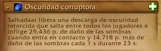

- El boss va a lanzar copias de sí mismo:

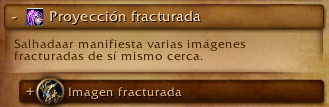

Las cuales deben ser interrumpidas o stuneadas por los jugadores, ya que si terminan su casteo harán daño a los jugadores y dejarán manchas en el suelo.

- El boss va a marcar a 3 jugadores con un debuff que es un healing absorb y debe ser curado.

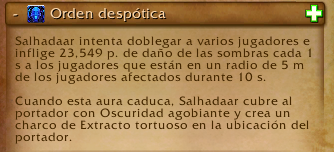

Al caducar o curarse por completo, se genera un charco bajo el jugador que va consumiendo la sala.

- Adicionalmente, el boss marcará al tank actual y le lanzará una bomba:

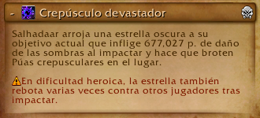

La cual tirará espinas en 5 direcciones visibles antes del impacto, por lo que el tank debe alejarse y los jugadores esquivar esto.

#### Hero

En dificultad heroica además se marcará a jugadores aleatorios con esta misma mecánica.

Este es el ciclo principal de la pelea.  
Al cumplir 2 de estos ciclos, el boss alcanza 100% de energía y entra en una interfase:

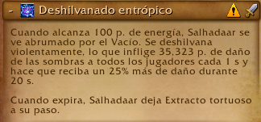

Donde recibirá daño aumentado y hará una habilidad donde lanzará 5 rayos que rotan en una dirección haciendo mucho daño y además irradiando daño constante.

Al terminar esta habilidad, el boss dejará un charco debajo suyo, por lo que debe ser movido antes a un lugar donde no estorbe el charco que dejará.

## Vaelgor y Ezzorak

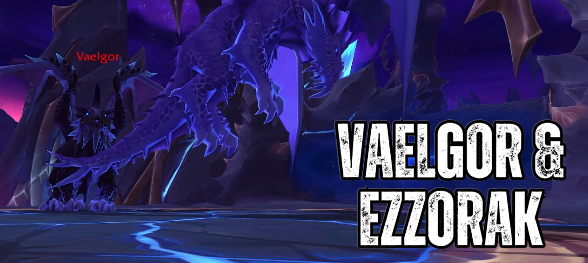

### Resumen

Esta pelea consta de 2 fases.

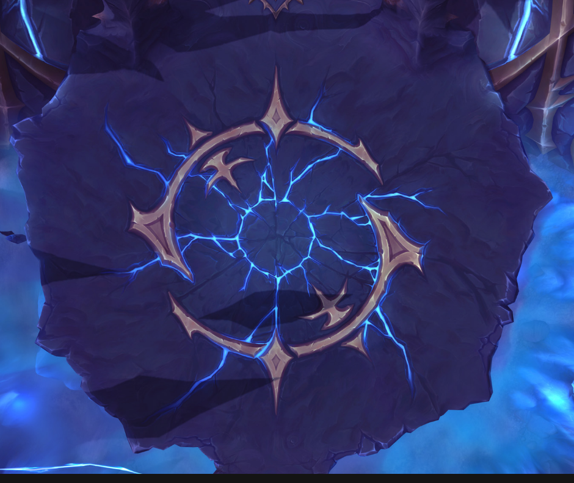

#### Fase 1

Durante esta fase los bosses estarán uno en el aire y otro en el suelo.  
La raid debe dividirse con un daño similar.

El boss que está en el aire no puede ser movido y estará volando en un lugar todo el tiempo.  
El boss del suelo sí podrá ser movido y debe ser alejado del boss volador o estos se potenciarán.

Además, no deberán tener más de un 10% de diferencia en sus vidas y deberán morir lo más cercano posible, ya que al morir uno, el dragón restante incrementa mucho su daño.

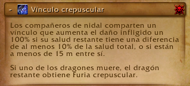

Al iniciar, el boss que está volando será Ezzorak y el que está en el suelo será Vaelgor (el boss más oscuro).

---

### Habilidades de Vaelgor

- Al comienzo de la pelea el boss seleccionará a un jugador con un cono frontal:

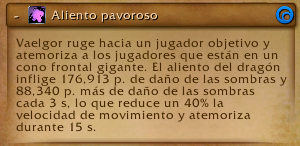

Será identificable por la flecha morada en su cabeza.

Este cono mete fear y daño a todos los jugadores que alcance, por lo que el jugador que lo reciba deberá ser dispeleado y curado por los healers.  
(Es posible utilizar inmunidades para evitar el daño y la mecánica).

- La siguiente habilidad será un aliento frontal:

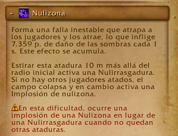

Esta habilidad será dirigida al tank que tenga al boss y lo empujará hacia atrás constantemente.

Al terminar de canalizar esta habilidad quedará un orbe en el suelo, el cual amarrará a todos los jugadores al centro del mismo.  
Los jugadores deberán alejarse y romper su cuerda saliendo de la zona marcada del orbe.

En esta habilidad el tank principal deberá dejarse su amarre para dar tiempo a los healers de levantar la raid y así poder romper su amarre causando daño a la raid de manera controlada.

---

### Habilidades de Ezzorak

- Primera habilidad:

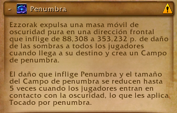

Lanzará un rayo largo que marcará la dirección de la habilidad, la cual consistirá en lanzar un agujero negro grande que se moverá lentamente hacia esa dirección y chocará contra el límite de la arena, haciendo un gran círculo de daño.

Tiene una mecánica importante:  
Si el agujero negro atraviesa a 5 jugadores, el área reducirá su tamaño significativamente.

#### Hero

En heroico esta habilidad marca a los jugadores, haciendo imposible que los mismos 5 activen la reducción de área, por lo que deberán rotarse.

El agujero negro aparece con un aura morada y al pasar por 5 jugadores se vuelve blanco indicando que alcanzó la reducción máxima.

---

- Segunda habilidad:

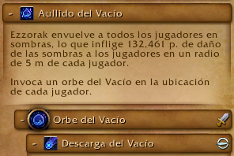

El boss marcará a todos los jugadores con un área morada y después de unos segundos invocará un orbe debajo de cada jugador (incluidos tanks y healers).

Estos orbes deben ser destruidos lo más rápido posible, ya que castearán daño a toda la raid.  
Deben colocarse cerca unos de otros, pero no completamente stackeados.

Estos adds pueden ser interrumpidos con cualquier CC.

---

### Orden de habilidades simultáneas

Todas estas habilidades suceden simultáneamente durante la fase 1 y se intercalan en este orden:

1. Aliento pavoroso 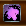
2. Penumbra 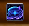
3. Nulirayo 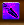
4. Aullido del vacío 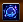

Las últimas dos suelen suceder a la vez, por lo que es importante retener el orbe generado por Nulirayo para no causar daño excesivo.

---

### Xal'atath

Durante toda la pelea Xal'atath estará casteando:

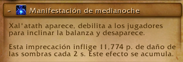

Los healers deben prestar atención a los jugadores marcados, ya que puede caer múltiples veces en el mismo objetivo.  
Los jugadores marcados deberán gestionar su vida con pociones, piedras de salud o defensivos personales.

---

Este patrón se repetirá hasta alcanzar 100% de energía en los dragones.  
Cuando esto suceda, entrarán en la siguiente fase casteando:

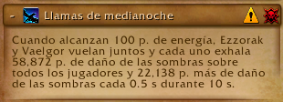

Causando una gran cantidad de daño y dando inicio a la Fase 2.

---

#### Fase 2

Durante esta fase ambos dragones causarán daño constante a la raid y los jugadores marcados por Xal'atath verán sus marcas disipadas.

- Uno de los paladines empezará a castear:

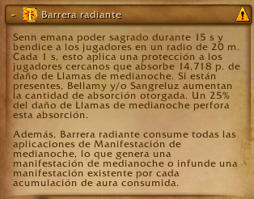

Reduciendo el daño recibido de los dragones.

Aparecerá un add que causará daño constante a la raid y deberá ser eliminado rápidamente.

Durante esta fase el daño será elevado, por lo que se requerirán CDs de healing.

Una vez finalizada la fase, los dragones intercambiarán posiciones (suelo y aire) y se repetirá el ciclo de la fase 1.

### Tanks

Durante toda esta pelea los tanks deben estar atentos a 2 habilidades y al correcto alejamiento de los bosses.  
Además, deberán intercambiar constantemente al dragón que se encuentra en el suelo, ya que el aéreo no cuenta con agro.

Las habilidades a tener en cuenta para Vaelgor serán:

Primera:

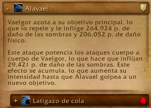

Esta habilidad colocará un debuff en el tank y deberá cambiarse cada 1 carga.  
Además, también golpeará a todos los jugadores que se encuentren en su cola, por lo que deberán posicionar al boss correctamente para no golpear a la raid.

Segunda:

Cuando esta habilidad sea lanzada, el tank actual deberá mantener el orbe con vida, evitando caer al centro del mismo mientras se estabilizan las vidas de la raid.  
Una vez que el orbe es invocado, el tank secundario deberá romper su amarre y tomar el agro del boss, siendo este el ciclo para Vaelgor.

En el caso de Ezzorak es la misma situación, solamente que las habilidades a tener en cuenta son:

Primera:

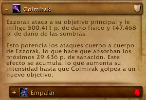

Funciona igual que la de Vaelgor.

Segunda:

Deberán cambiar el agro aproximadamente cuando esta suceda.

---

### Healers

Los healers en esta pelea tienen un trabajo difícil, ya que hay mucho daño en el tiempo con picos constantes y una fase de daño sostenido.

Deberán gestionar CDs en dos habilidades principales y mantener con vida a los jugadores marcados por Xal'atath, además de dispelear el fear cuando ocurra.

Las habilidades donde deben usar CDs son:

Primera:

Durante esta habilidad los jugadores recibirán mucho daño cada vez que los adds casteen, por lo que deberán usar CDs de healing en área.

Segunda:

Al ocurrir esta habilidad entramos en varios segundos de daño constante a toda la raid, por lo que debe gestionarse con CDs fuertes.

---

### DPS

Los DPS deben matar los diferentes adds que salen durante la pelea y dejarlos cerca unos de otros para facilitar el cleave.  
También deben interrumpir siempre que sea posible, romper amarres rápidamente y activar el agujero negro a su máxima reducción de área.

---

## Lightblinded Vanguard

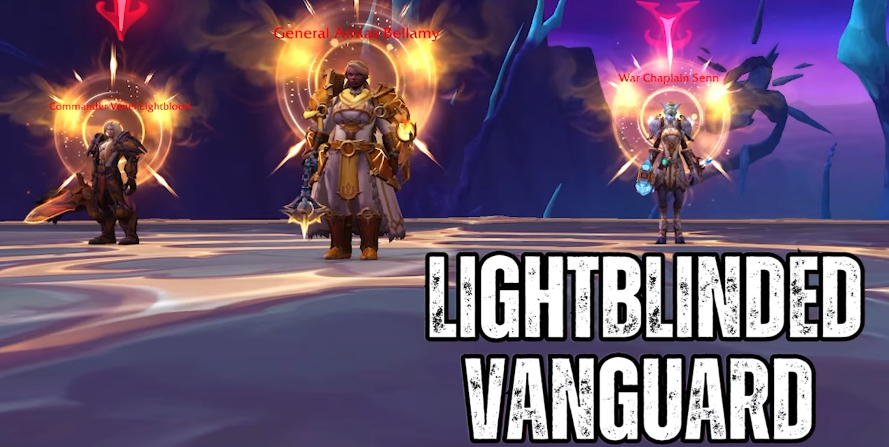

### Resumen

Esta pelea consta de 3 bosses con vidas separadas, los cuales deberán morir al mismo tiempo o muy cercanos en porcentaje.

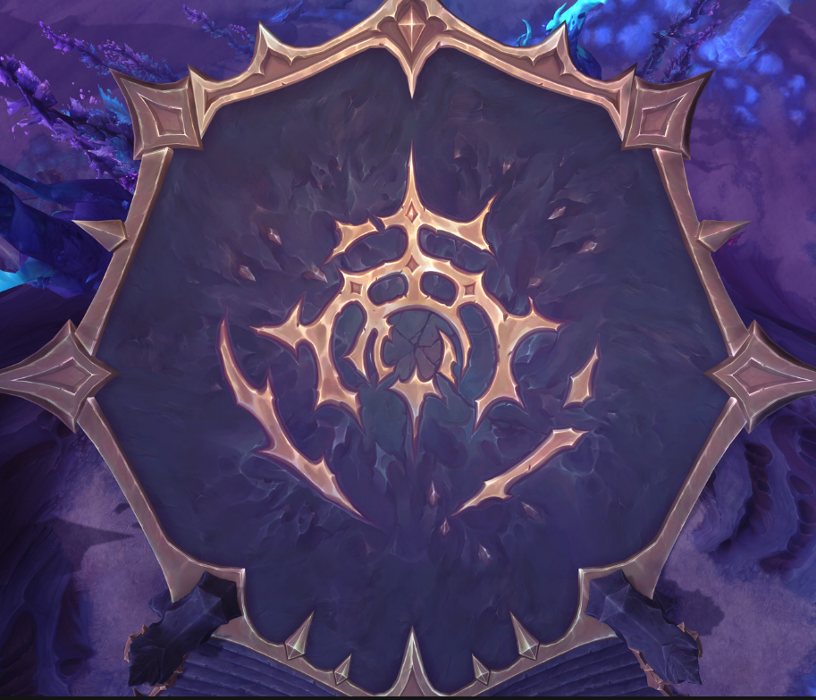

Al inicio, 2 de los 3 bosses se lanzarán inmunidad.  
Se debe hacer focus al único sin inmunidad y hacer el máximo daño posible.

Es una pelea de prioridad de target, por lo que es single target con cleave.

El ciclo consiste en cumplir mecánicas hasta que un boss complete su recurso y lance su habilidad definitiva llamada Aura.

---

### General Amias Bellamy

Será el primero en lanzar su Aura:

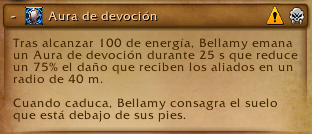

Al comenzar el casteo, los tanks y jugadores deben salir rápidamente del área.

Deben esquivar los escudos que salen desde el centro.  
Al finalizar quedará una consagración que hace mucho daño.

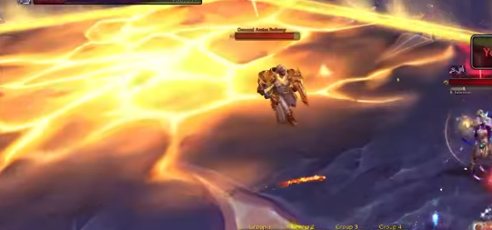

Siguiente habilidad:

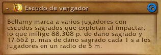

Marca jugadores con un escudo que causa daño dentro del círculo y aplica absorción de healing.

Daño constante:

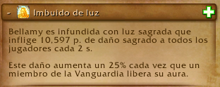

Se incrementa cada vez que otro boss lanza su Aura.

---

### Comandante Venel Sangreluz

Aura:

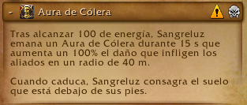

Potencia el daño de los demás bosses y deja consagración.

Soak grupal:

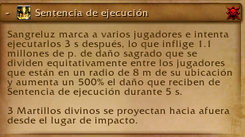

Debe dividirse el daño equitativamente.

Deja martillos que giran y se expanden.

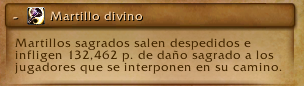

---

### Capellana de Guerra Senn

Aura:

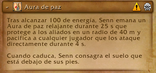

Silencia o desarma si se ataca dentro del área.

Absorción fuerte:

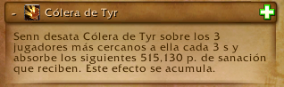

Daño masivo al lanzar Aura de compañeros:

Carga:

Debe romperse su escudo e interrumpirse.

---

### Tanks

Deben intercambiar según estas habilidades:

Solo se tankean 2 bosses; Senn no tiene agro.

---

### Healers

Habilidades clave:

Mucho manejo de absorciones y CDs.

---

### DPS

Cumplir soaks, cambiar targets correctamente y mantener porcentajes de vida equilibrados para evitar enrage.

---

## Alleria Brisaveloz

De este boss no se sabe nada hasta que salga la raid.

---

# Marcha sobre Quel Danas (2 bosses)

## Belo Ren

Este boss cambió mucho de la beta al retail, entonces mejor verlo cuando esté definitivo.

## Cae la Medianoche

No se sabe nada de este boss.

---

# La Onirifalla

## Chimaerus

### Resumen

Pelea de gestión de adds con dos planos existenciales.  
Parte de la raid estará fuera y parte dentro.  
Es una pelea claramente orientada a AoE.

---

#### Fase 1

Soak inicial:

Envía jugadores al plano onírico.

---

##### Plano onírico

Adds con escudo (solo reducible dentro) y vida normal (fuera).

El tank debe moverlos correctamente.

---

##### Plano normal

Limpiar suelos:

Cono frontal:

Adds que caminan al boss (prioridad):

Habilidad al 100%:

---

#### Fase 2

Vuelo devastador:

Caída:

DOT constante:

---

### Tanks

Turnarse soaks y mover adds correctamente.

---

### Healers

Curar DOT constante y gestionar CDs en cambios de fase.

---

### DPS

Eliminar todos los adds en ambos planos e interrumpir fears.

---

Y con esto termina esta guía de las raids.

